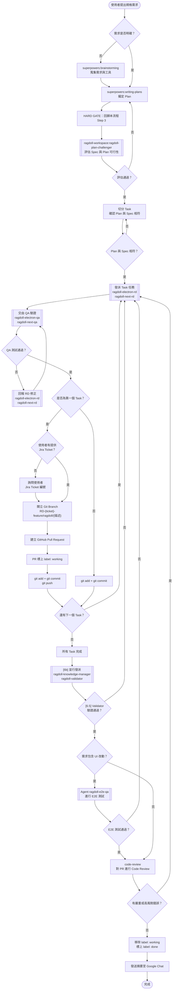

# Ragdoll AI Agent 開發工作流程

## 流程概覽（Mermaid 視覺化）



---

## 禁止使用的技能

以下技能與本工作流程衝突，**MUST NOT** 呼叫：

- `superpowers:subagent-driven-development`（本流程自帶 Subagent 發派）
- `superpowers:executing-plans`（同上）

本流程使用 `superpowers:brainstorming` 做需求蒐集，再使用 `superpowers:writing-plans` 擬定 Plan，Plan 完成後控制權回歸本流程的 Step 3。

---

## 環境前置檢查（每次開始工作前必做）

在進行任何 git / gh 操作前，必須先確認以下工具可用：

```bash
source ~/.bashrc
git --version
gh --version
```

- 若 `git` 不可用：請使用者安裝 [Git for Windows](https://git-scm.com/download/win) 並重新開啟終端機後再繼續。
- 若 `gh` 不可用：請使用者安裝 [GitHub CLI](https://cli.github.com/) 並執行 `gh auth login` 完成身分驗證後再繼續。

**工具未就緒時，不要嘗試自行修復 PATH 或繞過問題，直接告知使用者完成安裝與驗證後再回來。**

### husky pre-commit hook 失敗時的處理

若執行 `git commit` 時出現 `_/husky.sh: No such file or directory` 錯誤，執行：

```bash
cd .. && npx husky install
```

然後重新 commit。

---

## 詳細流程說明

### Step 1 — 接收需求

當使用者提出規格開發需求時：

- **若使用者已提供完整規格**（含 Jira ticket、驗收條件、功能描述），直接進入 Step 2 擬定 Plan。
- **僅在需求不明確時**才呼叫 `superpowers:brainstorming` 蒐集需求與上下文。

---

### Step 2 — 擬定 Plan

呼叫 `superpowers:writing-plans` 擬定實作計畫（Plan）。

---

### Step 2.5 — 回歸本工作流程（HARD GATE）

**`superpowers:writing-plans` 完成後，MUST 回到本工作流程的 Step 3。**

**MUST NOT** 繼續 superpowers 的預設流程（即不要呼叫 `superpowers:subagent-driven-development` 或 `superpowers:executing-plans`）。
本工作流程自帶 Task 切分與 Subagent 發派機制，不需要 superpowers 的執行層技能。

---

### Step 2.8 — 交由 Challenge Me 評估（HARD GATE）

**MUST** 在進入 Step 3 之前，將 Spec 與 Plan 交給 `ragdoll-workspace:ragdoll-plan-challenger` agent 進行可行性考核評估。

發派時需提供：
- 完整的需求 Spec（功能描述、驗收條件）
- `superpowers:writing-plans` 產出的 Plan 內容

**評估結果處理：**
- **評估通過**：進入 Step 3 切分 Task。
- **評估不通過**：Challenge Me 會指出不合理或有風險的設計，**MUST 回到 Step 2 重新擬定 Plan**，納入反饋修正後再次提交評估，直到評估通過為止。

---

### Step 3 — 切分 Task

- 根據 `superpowers:writing-plans` 產出的 Plan，切分為多個 **Task**（子任務），每個 Task 對應可獨立提交的工作單元。
- 確認 Plan 的每個 Task 均能對應到 Spec 的功能需求，確保沒有遺漏。
- **MUST** 開始此步驟後到 Step 7 完成前都不再需要與使用者互動
---

### Step 4 — 發派 Task 任務（HARD GATE）

**MUST** 使用以下 subagent 發派任務，**不得使用 general-purpose agent**：

| Subagent | 負責範圍 |
|---|---|
| `ragdoll-workspace:ragdoll-electron-rd` | Electron 層：SQLite、IPC、背景排程、Node.js 後端邏輯 |
| `ragdoll-workspace:ragdoll-next-rd` | Next.js 層：前端 UI、資料層、Store 串接 |

> 若 Task 同時涉及兩層，兩個 subagent 可並行發派。

---

### Step 5 — 交由 QA Subagent 進行測試驗證（HARD GATE）

**MUST** 在每個 Task 完成後交由對應 QA subagent 驗證，**QA 未通過前，不得 commit。**

| RD Subagent | 對應 QA Subagent |
|---|---|
| `ragdoll-workspace:ragdoll-electron-rd` | `ragdoll-workspace:ragdoll-electron-qa` |
| `ragdoll-workspace:ragdoll-next-rd` | `ragdoll-workspace:ragdoll-next-qa` |

> 若 Task 同時涉及兩層，兩個 QA subagent 可並行發派。

**測試未通過時的處理流程：**

1. QA subagent 回報測試失敗的詳細錯誤訊息與失敗原因。
2. 將錯誤資訊轉交給對應的 RD subagent 進行修正。
3. RD subagent 修正完成後，**直接重發 QA subagent 驗證，不需重走 Step 4 的發派流程。**
4. **重複上述步驟，直到 QA 測試全部通過為止。**

**QA 全部通過後，才能進入下一步的 Git Commit。**

---

### Step 6 — 每個 Task 完成後進行 Git Commit 與知識庫更新

每當 subagent 完成一個 Task 的實作，依序執行：

#### 6a. Git Commit

```bash
git add <相關檔案>
git commit -m "<清楚描述此 Task 的變更>"
```

#### 6b. 並行發派 Knowledge Manager 與 Validator

Commit 完成後，**同時並行發派**以下兩個 agent（不需等待彼此完成）：

**`ragdoll-workspace:ragdoll-knowledge-manager`**：將此 Task 的變更情境傳入，讓它自動更新受影響的專案知識庫文件。

發派時需提供的情境資訊：
- 此 Task 的變更摘要（做了什麼、改了哪些模組）
- 變更涉及的檔案清單（可從 git diff 取得）
- 對應的 Spec / Plan 段落（方便 Knowledge Manager 理解意圖）

**`ragdoll-workspace:ragdoll-validator`**：傳入 Github PR 位址與 Jira Ticket 位址，讓它驗證代碼變更是否對齊需求描述。

> 兩個 agent 皆在背景執行，不會阻擋下一個 Task 的開發。Validator 的結果將在 Step 6.5 統一確認。

---

### Step 6.5 — 等待 Knowledge Manager 與 Validator 完成（最後一個 Task 時）

當所有 Task 已完成，進入 Step 7 之前，**MUST** 確認所有背景執行的 agent 皆已完成：

1. **Knowledge Manager**：若有尚未完成的，等待其完成並將產出的知識庫文件 commit 後繼續。
2. **Validator**：等待 `ragdoll-workspace:ragdoll-validator` 完成驗證。
   - **驗證通過**：繼續進入 Step 7。
   - **驗證失敗**：將不對齊的項目轉交給對應的 RD subagent 修正（**回到 Step 4**），修正完成後重新走完 Step 5 → Step 6a → Step 6b → Step 6.5 的循環，直到 Validator 驗證通過為止。

---

### Step 7 — 執行 `wonderpet-general:github-pull-request-steps`

呼叫 **`wonderpet-general:github-pull-request-steps`** 技能，並帶入以下 Ragdoll 專案參數：

| 參數 | Ragdoll 專案的值 |
|---|---|
| 分支命名規則 | `RD-{jira-ticket}-feature/ragdoll/{30字以內的描述}` |
| PR 標題格式 | `[Ragdoll][RD-{jira-ticket}] {簡短描述}` |
| E2E QA Subagent | `ragdoll-workspace:ragdoll-e2e-qa`，需遵照 `ragdoll-workspace:ragdoll-e2e-workflow` 完整流程（含讀取 `ragdoll-workspace:ragdoll-checkout-flow`、`playwright-best-practices`，並至 `test-results/` 診斷失敗原因） |
| Code Review 失敗時回報對象 | `ragdoll-workspace:ragdoll-electron-rd`、`ragdoll-workspace:ragdoll-next-rd` |
| Google Chat 摘要標題 | `【Ragdoll 開發摘要】` |

---

## Subagent 對照表

| Subagent | 角色 | 技術範疇 |
|---|---|---|
| `ragdoll-workspace:ragdoll-electron-rd` | Electron 開發 | SQLite、IPC、Node.js 後端 |
| `ragdoll-workspace:ragdoll-next-rd` | Next.js 開發 | 前端 UI、Store、API 串接 |
| `ragdoll-workspace:ragdoll-e2e-qa` | E2E 測試 | Playwright、結帳流程測試 |
| `ragdoll-workspace:ragdoll-electron-qa` | Electron 測試 | Electron 層功能驗證 |
| `ragdoll-workspace:ragdoll-next-qa` | Next.js 測試 | Next.js 層功能驗證 |
| `ragdoll-workspace:ragdoll-validator` | 需求驗證 | 比對 PR 代碼變更與 Jira Ticket 驗收標準 |

---

## 分支命名規則

```
RD-{jira-ticket}-feature/ragdoll/{30個字以內的描述}
```

- `{jira-ticket}`: Jira Ticket 編號（若使用者未提供，必須詢問）
- `{描述}`: 以連字號分隔的英文短描述，30 字以內

**範例：**
- `RD-6857-feature/ragdoll/checkout-e2e-testing`
- `RD-1234-feature/ragdoll/discount-calculator-fix`
